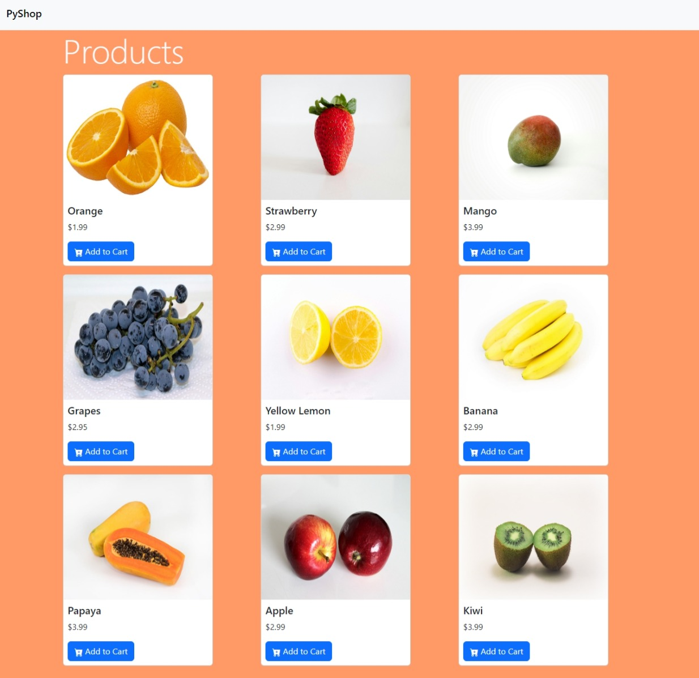

# PyShop

## Descrição

Esse é um projeto desenvolvido durante o curso de Python para iniciantes do canal "Programming with Mosh". O objetivo desse projeto foi aprender sobre o framework Django, desenvolvendo uma aplicação web simples que simula um e-commerce. O banco de dados SQLite foi utilizado para persistir os dados, o framework Bootstrap foi utilizado para estilizar a interface e o framework Django foi utilizado no back-end.

## Screenshot

## Tecnologias

